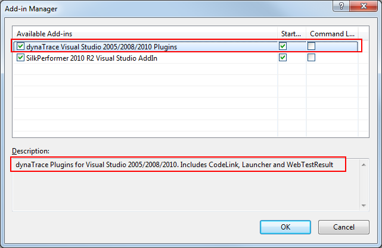
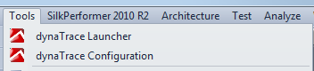
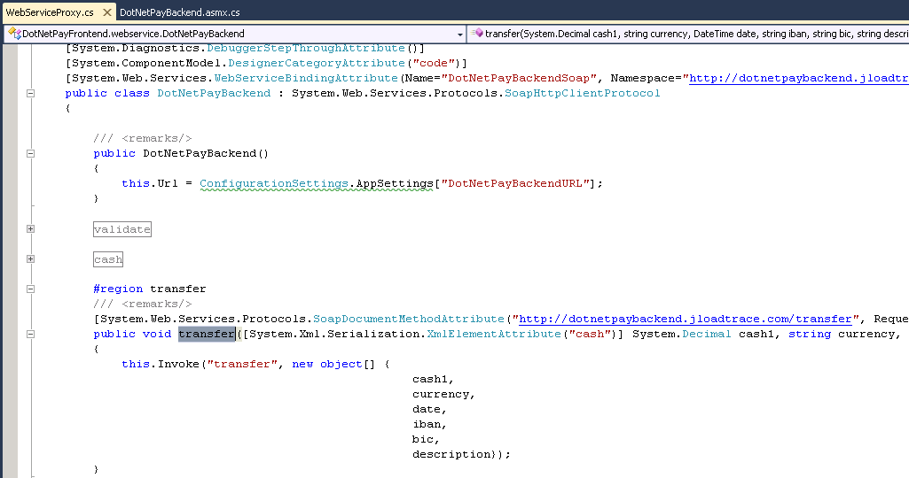
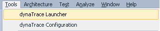
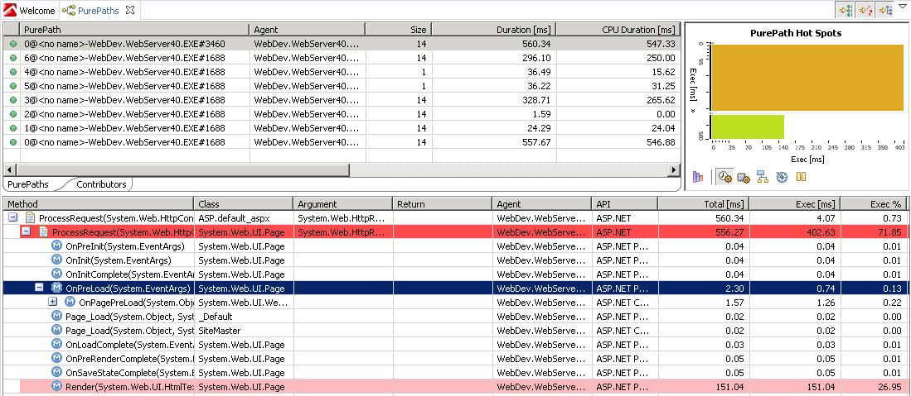
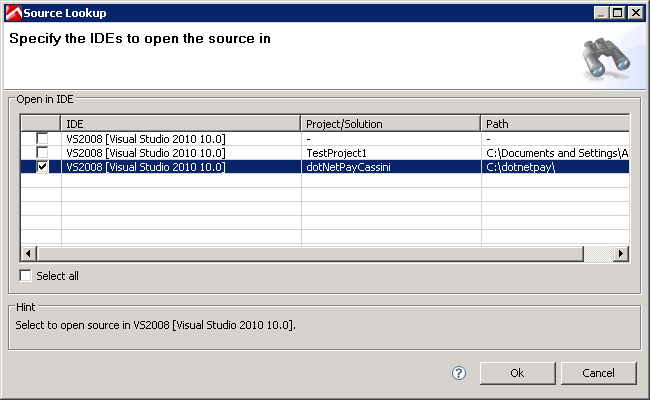

# Visual Studio 2005 and 2008 IDE Plugins

## Overview

 dynaTrace provides plugins for Visual Studio 2005/2008 to enable **Automatic Code
Lookups** from the dynaTrace Client, **Automatic Agent injection** when launching an application from the IDE

## Plugin Details

| Name |  Visual Studio 2005 and 2008 IDE Plugins
| :--- | :---
| Author | dynaTrace Software
| Supported dynaTrace Versions | >= 5.5
| License | [dynaTrace BSD](dynaTraceBSD.txt)
| Support | [Supported](https://community.compuwareapm.com/community.compuwareapm.com/community/display/DL/Support+Levels)
| Known Problems | [KB-424 Visual Studio Plugin will not work](https://community.compuwareapm.com/community/display/KB/KB-424+Visual+Studio+Plugin+will+not+work)  
| | [KB-462 Visual Studio shows error number 80131515 on startup](https://community.compuwareapm.com/community.dynatrace.com/community/display/KB/KB-462+Visual+Studio+shows+error+number+80131515+on+startup+when+Add-in+is+activated)
| Release History | 2010-04-14 Initial Release
| | 2010-11-02 Release for dynaTrace 3.5
| Download | [dynaTrace 6.0 Plugin for Visual Studio 2005/2008](CodeLinkVS2005.dt60.zip)
| | [dynaTrace 5.5 Plugin for Visual Studio 2005/2008](CodeLinkVS2005.dt55.zip)

## Installation

All you need to do is to extract the files of the [dynaTrace 3.5 Plugin for Visual Studio 2005/2008](attachments_47317091_2_CodeLinkVS2005.zip) to your My Documents\Visual Studio 2005/2008\Addins
directory. If the Addins directory does not exist create it. **Now start Visual Studio as Administrator** \- this is required as the dynaTrace plugin requires access to the registry

The dynaTrace Visual Studio 2005/2008 Plugin can be enabled through Tools->Add-In Manager in Visual Studio. Once the Add-In is loaded you will see two new menu entries in the Tools menu. One is to
configure the dynaTrace Plugin, the other one is to Launch the currently opened project by automatically injecting the dynaTrace .NET Agent into the launched application.

## What the plugin provides

This plugin allows you to **Lookup Source Code** for a method traced by dynaTrace. From the dynaTrace Client you can select a method in the Methods or PurePath Dashlet and Lookup the method in Visual
Studio.

The plugin also allows you to **launch an application** from the IDE and automatically inject the dynaTrace Agent to trace the launched application.

## Screenshots

The dynaTrace Add-On has to be enabled through Tools->Add-In Manager

Once the dynaTrace Add-On is enabled we get two menu entries in the tools menu

Code of the selected method opened in Visual Studio

Menu Entry that will launch the current project with injected dynaTrace Agent

PurePath that will be captured for every request executed against the launched application

Lookup the source code of a method from the dynaTrace Client

